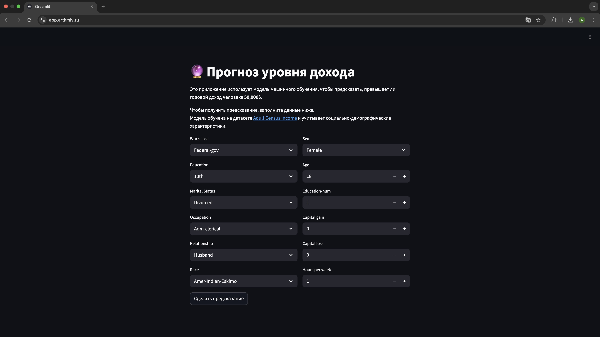

# ML-модель для предсказания дохода

Проект демонстрирует полный цикл работы ML-фичи в продакшене:  
**Обучение модели > API для предсказаний > веб-интерфейс для пользователей.**

---

### Основной функционал

- **ML-пайплайн** обучения модели `GradientBoostingClassifier`
- **API на FastAPI**
    - `GET /person_categories` — отдаёт справочники, необходимые для интерфейса
    - `POST /predict` — предсказывает, превышает ли доход $50k
- **UI на Streamlit** для пользователя

### Хостинг

UI и API развёрнуты на сервере и работают в Docker-контейнерах.

- UI: https://app.artkmlv.ru  
- API: https://api.artkmlv.ru/docs